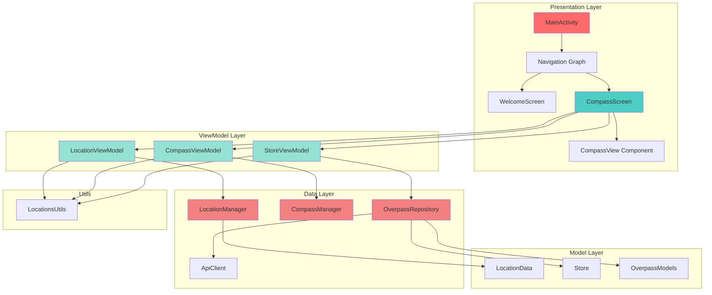
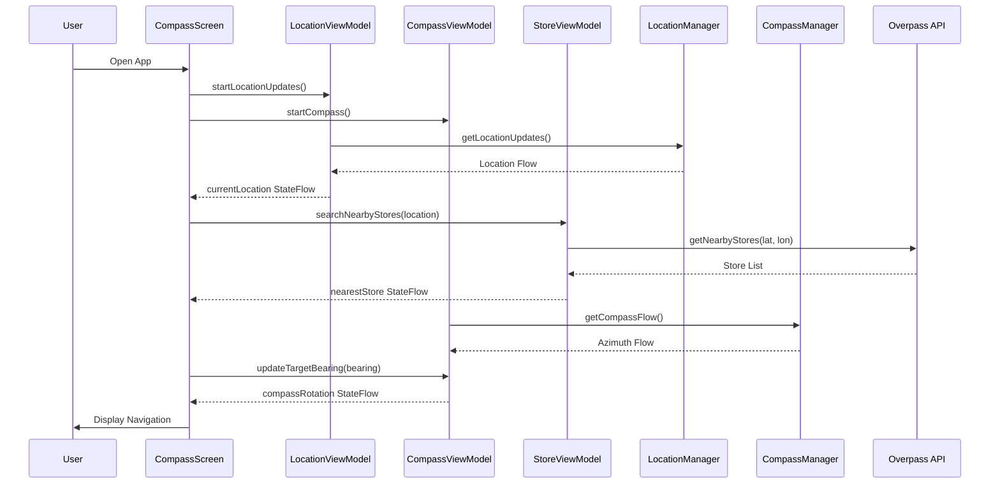

<div align="center">

# 🧭 Nearest Compass

### *Find Your Way to the Nearest Store*

[](https://kotlinlang.org)
[](https://www.android.com)
[](https://developer.android.com/jetpack/compose)
[](LICENSE)
[](https://github.com/berat-karabuga/NearestCompass/actions)

**A smart Android compass application that guides you to the nearest convenience store or supermarket using real-time location tracking and sensor fusion.**

[Features](#-features) • [Screenshots](#-screenshots) • [Architecture](#-architecture) • [Installation](#-installation) • [Usage](#-usage) • [Tech Stack](#-tech-stack)

</div>

---

## 🌟 Features

<table>
<tr>
<td width="50%">

### 🎯 Core Functionality
- **Real-time Location Tracking** - Continuous GPS monitoring with high accuracy
- **Smart Compass Navigation** - Sensor fusion for precise directional guidance
- **Nearby Store Discovery** - Automatic detection of convenience stores and supermarkets within 2km radius
- **Distance Calculation** - Haversine formula for accurate distance measurement
- **Turn-by-Turn Directions** - Intuitive directional instructions (e.g., "Turn Slightly Right", "Take a Sharp Left Turn")

</td>
<td width="50%">

### ⚡ Technical Highlights
- **MVVM Architecture** - Clean, maintainable code structure
- **Jetpack Compose UI** - Modern, declarative user interface
- **Coroutines & Flow** - Reactive programming for smooth UX
- **Sensor Management** - Accelerometer + Magnetometer fusion
- **REST API Integration** - Overpass API for OpenStreetMap data
- **Permission Handling** - Runtime location permission management

</td>
</tr>
</table>

---

## 📸 Screenshots

<div align="center">

| Welcome Screen | Location Permission | Searching Stores | Navigation Active |
|:---:|:---:|:---:|:---:|
|  |  |  |  |
| *Clean, minimalist welcome interface* | *Permission request dialog* | *Real-time store search in progress* | *Active compass navigation with distance* |

</div>

---

## 🏗️ Architecture

### MVVM Pattern with Clean Architecture



### Data Flow Diagram



---

## 📁 Project Structure

```
com.stargazer.nearestcompass/
│
├── 📱 MainActivity.kt                    # Application entry point
│
├── 🧭 navigation/
│   ├── Screen.kt                         # Navigation routes
│   └── NavGraph0.kt                      # Navigation graph setup
│
├── 🎨 ui/
│   ├── components/
│   │   └── CompassView.kt                # Custom compass UI component
│   ├── screens/
│   │   ├── WelcomeScreen.kt              # Onboarding & permissions
│   │   └── CompassScreen.kt              # Main navigation screen
│   └── theme/
│       └── NearestCompassTheme.kt        # Material 3 theme
│
├── 🧠 viewmodel/
│   ├── LocationViewModel.kt              # Location state management
│   ├── CompassViewModel.kt               # Compass sensor management
│   └── StoreViewModel.kt                 # Store search logic
│
├── 💾 data/
│   ├── model/
│   │   ├── LocationData.kt               # Location data class
│   │   ├── Store.kt                      # Store entity + enum
│   │   └── OverpassModels.kt             # API response models
│   ├── location/
│   │   ├── LocationManager.kt            # GPS & location services
│   │   └── CompassManager.kt             # Sensor fusion logic
│   └── repository/
│       ├── OverpassRepository.kt         # API data source
│       └── ApiClient.kt                  # Ktor HTTP client
│
└── 🛠️ utils/
    └── LocationsUtils.kt                 # Haversine, bearing calculations
```

---

## 🔧 Tech Stack

<table>
<tr>
<td width="33%">

### **Language & Framework**
-  **Kotlin 1.9.0**
-  **Jetpack Compose**

</td>
<td width="33%">

### **Architecture & Patterns**
- 🏛️ **MVVM Architecture**
- 🔄 **Repository Pattern**
- 🌊 **Reactive Streams (Flow)**
- 🧩 **Dependency Injection**

</td>
<td width="33%">

### **Libraries & APIs**
- 🌍 **Google Location Services**
- 📡 **Overpass API (OSM)**
- 🌐 **Ktor Client**
- 📊 **Gson Serialization**

</td>
</tr>
</table>

### Detailed Dependencies

| Category | Library | Version | Purpose |
|----------|---------|---------|---------|
| **UI** | Jetpack Compose | 1.5.0 | Declarative UI framework |
| **Navigation** | Compose Navigation | 2.7.0 | Screen navigation |
| **Architecture** | Lifecycle ViewModel | 2.6.1 | State management |
| **Async** | Kotlin Coroutines | 1.7.3 | Asynchronous programming |
| **Location** | Google Play Services Location | 21.0.1 | GPS & location tracking |
| **Sensors** | Android Sensor Framework | Native | Accelerometer + Magnetometer |
| **Network** | Ktor Client Android | 2.3.2 | HTTP client |
| **Serialization** | Gson | 2.10.1 | JSON parsing |
| **Permissions** | Accompanist Permissions | 0.32.0 | Runtime permission handling |

---

## ⚙️ Installation

### Prerequisites

- **Android Studio**: Hedgehog (2023.1.1) or later
- **JDK**: Version 17 or higher
- **Target SDK*: 36
- **Gradle**: 8.0+

### Setup Instructions

1. **Clone the repository**
   ```bash
   git clone https://github.com/berat-karabuga/NearestCompass.git
   cd NearestCompass
   ```

2. **Open in Android Studio**
   - Launch Android Studio
   - Select `File > Open`
   - Navigate to the cloned directory
   - Wait for Gradle sync to complete

3. **Configure API Keys** *(Optional)*
   > **Note**: This app uses the public Overpass API, no API key required!

4. **Build the project**
   ```bash
   ./gradlew build
   ```

5. **Run on device/emulator**
   - Connect an Android device with USB debugging enabled, or
   - Start an Android Virtual Device (AVD)
   - Click `Run > Run 'app'` or press `Shift + F10`

---

## 🚀 Usage

### Step-by-Step Guide

1. **Launch the App**
   - Open Nearest Compass on your device
   - You'll see the welcome screen with "Find nearest!" tagline

2. **Grant Location Permissions**
   - Tap "Let's Find" button
   - Allow precise location access when prompted
   - Choose "While using the app" for best experience

3. **Wait for Location Lock**
   - App will acquire your GPS coordinates
   - Accuracy information displayed at the top
   - Typical accuracy: 5-20 meters

4. **Store Search Begins Automatically**
   - App searches for stores within 2km radius
   - Queries both convenience stores and supermarkets
   - Results sorted by distance

5. **Follow the Compass**
   - Red arrow points to nearest store
   - Distance shown in meters or kilometers
   - Turn-by-turn instructions update as you move
   - Compass rotates based on device orientation

### Features Breakdown

#### 🧭 Compass Navigation
- **Sensor Fusion**: Combines accelerometer and magnetometer data
- **Smoothing Algorithm**: 10-sample moving average for stability
- **Bearing Calculation**: Accurate angular measurement using trigonometry
- **Real-time Updates**: 2-5 second refresh intervals

#### 📍 Location Tracking
- **High Accuracy Mode**: GPS + Network + Sensors
- **Continuous Updates**: Every 5 seconds (minimum 2s interval)
- **Battery Optimized**: Smart location request intervals
- **Accuracy Threshold**: Waits for <20m accuracy before searching

#### 🏪 Store Detection
- **Search Radius**: 2000 meters (configurable)
- **Store Types**: 
  - `shop=convenience` (Local groceries, small markets)
  - `shop=supermarket` (Large chain supermarkets)
- **Data Source**: OpenStreetMap via Overpass API
- **Sorting**: Automatic distance-based ranking

---

## 🌐 API Integration

### Overpass API Query Structure

The app uses a custom Overpass QL query to find nearby stores:

```overpassql
[out:json][timeout:25];
(
  node["shop"="convenience"](around:2000,41.025756,28.694833);
  node["shop"="supermarket"](around:2000,41.025756,28.694833);
);
out body;
>;
out skel qt;
```

**Query Breakdown:**
- `[out:json]`: Response format
- `[timeout:25]`: Maximum query time (25 seconds)
- `node["shop"="convenience"]`: Filter for convenience stores
- `(around:2000,lat,lon)`: Search within 2km radius
- `out body`: Return full node data including tags

### API Response Handling

```kotlin
data class OverpassModels(
    val version: String?,
    val elements: List<OverpassElement>
)

data class OverpassElement(
    val type: String?,
    val id: Long?,
    val lat: Double?,
    val lon: Double?,
    val tags: OverpassTags?
)
```

---

## 📐 Mathematical Algorithms

### 1. Haversine Distance Formula

Calculates the great-circle distance between two GPS coordinates:

```kotlin
fun calculateDistance(from: LocationData, to: LocationData): Double {
    val earthRadius = 6371000.0 // meters
    
    val lat1 = Math.toRadians(from.latitude)
    val lat2 = Math.toRadians(to.latitude)
    val deltaLat = Math.toRadians(to.latitude - from.latitude)
    val deltaLon = Math.toRadians(to.longitude - from.longitude)
    
    val a = sin(deltaLat / 2).pow(2) +
            cos(lat1) * cos(lat2) *
            sin(deltaLon / 2).pow(2)
    
    val c = 2 * atan2(sqrt(a), sqrt(1 - a))
    
    return earthRadius * c
}
```

**Accuracy**: ±0.5% for distances up to 100km

### 2. Bearing Calculation

Computes the initial bearing (forward azimuth) to target:

```kotlin
fun calculateBearing(from: LocationData, to: LocationData): Float {
    val lat1 = Math.toRadians(from.latitude)
    val lat2 = Math.toRadians(to.latitude)
    val deltaLon = Math.toRadians(to.longitude - from.longitude)
    
    val y = sin(deltaLon) * cos(lat2)
    val x = cos(lat1) * sin(lat2) -
            sin(lat1) * cos(lat2) * cos(deltaLon)
    
    val bearing = Math.toDegrees(atan2(y, x))
    
    return ((bearing + 360) % 360).toFloat()
}
```

**Output**: 0-360° where 0° = North, 90° = East

### 3. Sensor Fusion for Compass

Combines accelerometer and magnetometer readings:

```kotlin
private fun updateOrientation(): Float? {
    val rotationMatrix = FloatArray(9)
    val orientationAngles = FloatArray(3)
    
    val success = SensorManager.getRotationMatrix(
        rotationMatrix,
        null,
        accelerometerReading,
        magnetometerReading
    )
    
    if (success) {
        SensorManager.getOrientation(rotationMatrix, orientationAngles)
        val azimuthInRadians = orientationAngles[0]
        val azimuthInDegrees = Math.toDegrees(azimuthInRadians.toDouble()).toFloat()
        return (azimuthInDegrees + 360) % 360
    }
    return null
}
```

**Smoothing**: 10-sample moving average filter reduces jitter

---

## 🎨 UI Components

### CompassView Composable

Custom Canvas-based compass implementation:

```kotlin
@Composable
fun CompassView(rotation: Float, modifier: Modifier = Modifier) {
    Canvas(modifier = Modifier.size(300.dp)) {
        val center = Offset(size.width / 2f, size.height / 2f)
        val radius = size.minDimension / 2f
        
        // Outer ring
        drawCircle(color = Color.LightGray, radius = radius, center = center)
        
        // Inner ring
        drawCircle(color = Color.Gray, radius = radius * 0.9f, center = center)
        
        // Rotatable red arrow
        rotate(degrees = rotation, pivot = center) {
            val arrowPath = Path().apply {
                moveTo(center.x, center.y)
                lineTo(center.x - 20f, center.y + 40f)
                lineTo(center.x, center.y - radius * 0.7f)
                lineTo(center.x + 20f, center.y + 40f)
                close()
            }
            drawPath(path = arrowPath, color = Color.Red)
        }
    }
}
```

**Design Philosophy**: Minimalist, high-contrast for outdoor visibility

---

## 🔒 Permissions

### Required Permissions

```xml
<!-- Manifest.xml -->
<uses-permission android:name="android.permission.ACCESS_FINE_LOCATION" />
<uses-permission android:name="android.permission.ACCESS_COARSE_LOCATION" />
<uses-permission android:name="android.permission.INTERNET" />
```

### Runtime Permission Handling

```kotlin
@OptIn(ExperimentalPermissionsApi::class)
val locationPermissionsState = rememberMultiplePermissionsState(
    permissions = listOf(
        android.Manifest.permission.ACCESS_FINE_LOCATION,
        android.Manifest.permission.ACCESS_COARSE_LOCATION
    )
)
```

**User Experience**: 
- Requests only when needed
- Explains why permissions are necessary
- Graceful degradation if denied

---

## 🧪 Testing

### CI/CD Pipeline

The project uses **GitHub Actions** for continuous integration:

```yaml
# .github/workflows/android.yml
name: Android CI

on:
  push:
    branches: [ master ]
  pull_request:
    branches: [ master ]

jobs:
  build:
    runs-on: ubuntu-latest
    steps:
      - uses: actions/checkout@v3
      - name: Set up JDK 17
        uses: actions/setup-java@v3
        with:
          java-version: '17'
      - name: Grant execute permission for gradlew
        run: chmod +x gradlew
      - name: Build with Gradle
        run: ./gradlew build
```

### Manual Testing Checklist

- [ ] Location permission granted/denied scenarios
- [ ] GPS accuracy in urban/rural environments
- [ ] Compass rotation accuracy (use known landmarks)
- [ ] API timeout handling (airplane mode test)
- [ ] Battery consumption over 30 minutes
- [ ] Sensor calibration prompts

---

## 🐛 Known Issues & Roadmap

### Current Limitations

- ⚠️ **Indoor Accuracy**: GPS struggles inside buildings (expected behavior)
- ⚠️ **Magnetic Interference**: Compass affected by metal objects
- ⚠️ **API Rate Limit**: Overpass API has usage limits (rarely hit)

---

## 📄 License

```
MIT License

Copyright (c) 2024 Berat Karabuga

Permission is hereby granted, free of charge, to any person obtaining a copy
of this software and associated documentation files (the "Software"), to deal
in the Software without restriction, including without limitation the rights
to use, copy, modify, merge, publish, distribute, sublicense, and/or sell
copies of the Software, and to permit persons to whom the Software is
furnished to do so, subject to the following conditions:

The above copyright notice and this permission notice shall be included in all
copies or substantial portions of the Software.

THE SOFTWARE IS PROVIDED "AS IS", WITHOUT WARRANTY OF ANY KIND, EXPRESS OR
IMPLIED, INCLUDING BUT NOT LIMITED TO THE WARRANTIES OF MERCHANTABILITY,
FITNESS FOR A PARTICULAR PURPOSE AND NONINFRINGEMENT. IN NO EVENT SHALL THE
AUTHORS OR COPYRIGHT HOLDERS BE LIABLE FOR ANY CLAIM, DAMAGES OR OTHER
LIABILITY, WHETHER IN AN ACTION OF CONTRACT, TORT OR OTHERWISE, ARISING FROM,
OUT OF OR IN CONNECTION WITH THE SOFTWARE OR THE USE OR OTHER DEALINGS IN THE
SOFTWARE.
```

---

## 👨‍💻 Author

**Berat Karabuga**

[](https://github.com/berat-karabuga)
[](https://www.linkedin.com/in/hüseyin-berat-karabuğa/)

---

## 🙏 Acknowledgments

- **OpenStreetMap Contributors** - For the comprehensive location database
- **Overpass API** - For the powerful query interface
- **Google** - For Android Location Services and Material Design
- **JetBrains** - For the amazing Kotlin language
- **Android Community** - For countless helpful resources

---

<div align="center">

### ⭐ If you find this project useful, please consider giving it a star!

**Made with ❤️ and ☕ by Berat Karabuga**

[⬆ Back to Top](#-nearest-compass)

</div>
